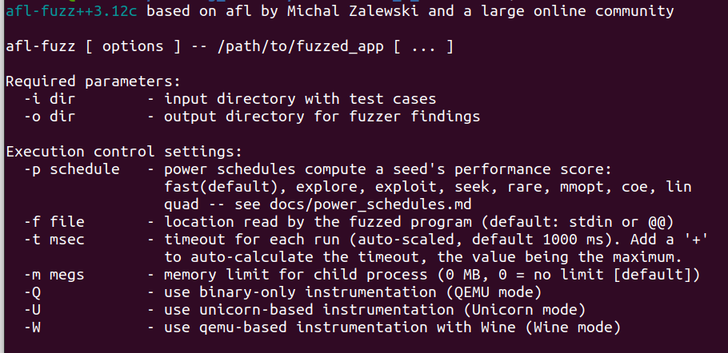
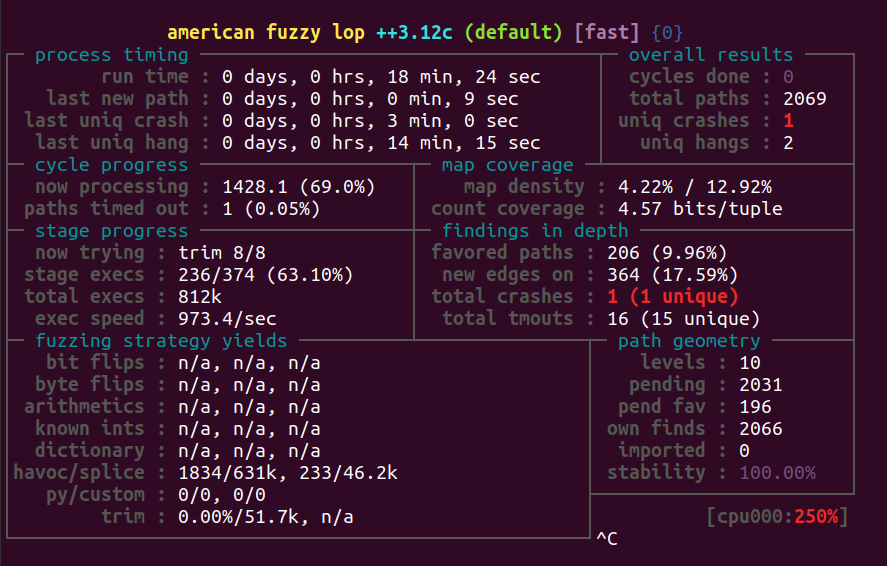
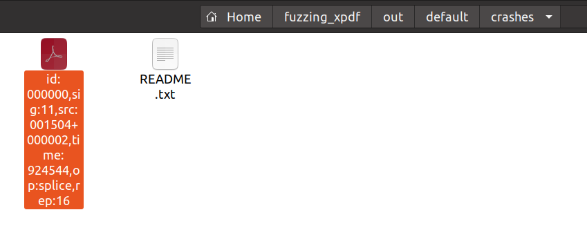

# Exercise 1 - Xpdf

For this exercize we will fuzz **Xpdf** PDF viewer. The goal is to find a crash/PoC for [**CVE-2019-13288**](https://www.cvedetails.com/cve/CVE-2019-13288/) in XPDF 3.02. 

<details>
  <summary>For more information about CVE-2019-13288 vulnerability, click me!</summary>
  --------------------------------------------------------------------------------------------------------
  
  **CVE-2019-13288** is a vulnerability that may cause an infinite recursion via a crafted file.
  
  Since each called function in a program allocates a stack frame on the stack, if a a function is recursively called so many times it can lead to stack memory exhaustion and program crash.
  
 As a result, a remote attacker can leverage this for a DoS attack.
 
 You can find more information about Uncontrolled Recursion vulnerabilities at the following link: https://cwe.mitre.org/data/definitions/674.html
  
</details>

## What you will learn
After completing this exercise, you will know the basis of fuzzing with AFL, such as:   
- Compiling a target application with instrumentation 
- Running a fuzzer (afl-fuzz)
- Triaging crashes with a debugger (GDB)

## Read Before Start
- I suggest you to try to **solve the exercise by yourself** without checking the solution. Try as hard as you can, and only if you get stuck, check out the example solution below.
- AFL uses a non-deterministic testing algorithm, so two fuzzing sessions are never the same. That's why I highly recommend **to set a fixed seed (-s 123)**. This way your fuzzing results will be similar to those shown here and that will allow you to follow the exercises more easily.  
- If you find a new vulnerability, **please submit a security report** to the project. If you need help or have any doubt about the process, the [GitHub Security Lab](mailto:securitylab.github.com) can help you with it :)

## Contact
Are you stuck and looking for help? Do you have suggestions for making this course better or just positive feedback so that we create more similar content?
Do you want to share your fuzing experience with the community?
Join the GitHub Security Lab Slack and head to the `#fuzzing` channel. [Request an invite to the GitHub Security Lab Slack](mailto:securitylab-social@github.com?subject=Request%20an%20invite%20to%20the%20GitHub%20Security%20Lab%20Slack)

## Environment

All the exercises have been tested on **Ubuntu 20.04.2 LTS**. I highly recommend you to use **the same OS version** to avoid different fuzzing results and to run AFL++ **on bare-metal** hardware, and not virtualized machines, for best performance.

Otherwise, you can find an Ubuntu 20.04.2 LTS VMware image [here](https://drive.google.com/file/d/1_m1x-SHcm7Muov2mlmbbt8nkrMYp0Q3K/view?usp=sharing). You can also use VirtualBox instead of VMware.

The username / password for this VM are `fuzz` / `fuzz`.

## Download and build your target

Let's first get our fuzzing target. Create a new directory for the project you want to fuzz:
```
cd $HOME
mkdir fuzzing_xpdf && cd fuzzing_xpdf/
```
To get your environment fully ready, you may need to install some additional tools (namely make and gcc) 
```
sudo apt install build-essential
```

Download Xpdf 3.02:
```
wget https://dl.xpdfreader.com/old/xpdf-3.02.tar.gz
tar -xvzf xpdf-3.02.tar.gz
```

Build Xpdf:
```
cd xpdf-3.02
sudo apt update && sudo apt install -y build-essential gcc
./configure --prefix="$HOME/fuzzing_xpdf/install/"
make
make install
```

Time to test the build. First of all, You'll need to download a few PDF examples:
```
cd $HOME/fuzzing_xpdf
mkdir pdf_examples && cd pdf_examples
wget https://github.com/mozilla/pdf.js-sample-files/raw/master/helloworld.pdf
wget http://www.africau.edu/images/default/sample.pdf
wget https://www.melbpc.org.au/wp-content/uploads/2017/10/small-example-pdf-file.pdf
```

Now, we can test the pdfinfo binary with:
```
$HOME/fuzzing_xpdf/install/bin/pdfinfo -box -meta $HOME/fuzzing_xpdf/pdf_examples/helloworld.pdf
```

You should see something like this:


## Install AFL++
For this course, we're going to use the latest version of [AFL++ fuzzer](https://github.com/AFLplusplus/AFLplusplus). 

You can install everything in two ways:  

<details>
  <summary>Local installation (recommended option)</summary>
  
  Install the dependencies

  ```
  sudo apt-get update
  sudo apt-get install -y build-essential python3-dev automake git flex bison libglib2.0-dev libpixman-1-dev python3-setuptools
  sudo apt-get install -y lld-11 llvm-11 llvm-11-dev clang-11 || sudo apt-get install -y lld llvm llvm-dev clang 
  sudo apt-get install -y gcc-$(gcc --version|head -n1|sed 's/.* //'|sed 's/\..*//')-plugin-dev libstdc++-$(gcc --version|head -n1|sed 's/.* //'|sed 's/\..*//')-dev
  ```

  Checkout and build AFL++
  ```
  cd $HOME
  git clone https://github.com/AFLplusplus/AFLplusplus && cd AFLplusplus
  export LLVM_CONFIG="llvm-config-11"
  make distrib
  sudo make install
  ```
</details>

<details>
  <summary>Docker image</summary>
  
  Install docker
  ```
  sudo apt install docker
  ```
  
  Pull the image
  ```
  docker pull aflplusplus/aflplusplus
  ```
  
  Launch the AFLPlusPlus docker container:
  ```
  docker run -ti -v $HOME:/home aflplusplus/aflplusplus
  ```
  and then type
  ```
  export $HOME="/home"
  ```
</details>

Now if all went well, you should be able to run afl-fuzz. Just type

```afl-fuzz```

and you should see something like this:



### Meet AFL++

AFL is a **coverage-guided fuzzer**, which means that it gathers coverage information for each mutated input in order to discover new execution paths and potential bugs. When source code is available AFL can use instrumentation, inserting function calls at the beginning of each basic block (functions, loops, etc.)

To enable instrumentation for our target application, we need to compile the code with AFL's compilers. 

First of all, we're going to clean all previously compiled object files and executables:
```
rm -r $HOME/fuzzing_xpdf/install
cd $HOME/fuzzing_xpdf/xpdf-3.02/
make clean
```

And now we're going to build xpdf using the **afl-clang-fast** compiler:
```
export LLVM_CONFIG="llvm-config-11"
CC=$HOME/AFLplusplus/afl-clang-fast CXX=$HOME/AFLplusplus/afl-clang-fast++ ./configure --prefix="$HOME/fuzzing_xpdf/install/"
make
make install
```

Now, you can run the fuzzer with the following command:
```
afl-fuzz -i $HOME/fuzzing_xpdf/pdf_examples/ -o $HOME/fuzzing_xpdf/out/ -s 123 -- $HOME/fuzzing_xpdf/install/bin/pdftotext @@ $HOME/fuzzing_xpdf/output
```

A brief explanation of each option:
- *-i* indicates the directory where we have to put the input cases (a.k.a file examples)
- *-o* indicates the directory where AFL++ will store the mutated files
- *-s* indicates the static random seed to use
- *@@* is the placeholder target's command line that AFL will substitute with each input file name

So, basically the fuzzer will run the command   
`$HOME/fuzzing_xpdf/install/bin/pdftotext <input-file-name> $HOME/fuzzing_xpdf/output` for each different input file.

If you receive a message like *"Hmm, your system is configured to send core dump notifications to an external utility..."*, just do:
```
sudo su
echo core >/proc/sys/kernel/core_pattern
exit
```

After a few minutes you should see something like this:



You can see the **"uniq. crashes"** value in red, showing the number of unique crashes found. You can find these crashes files in the `$HOME/fuzzing_xpdf/out/` directory. You can stop the fuzzer once the first crash is found, this is the one we'll work on. It can take up to one or two hours depending on your machine performance, before you get a crash.

A this stage, you have learned: 
- How to compile a target using afl compiler with instrumentation
- How to launch afl++
- How to detect unique crashes of your target

So what's next? We don't have any information on this bug, just a crash of the program... It's time for debugging and triage!

## Do it yourself!
In order to complete this exercise, you need to:
1) Reproduce the crash with the indicated file 
2) Debug the crash to find the problem
3) Fix the issue

**Estimated time = 120 mins**

---

<details>
  <summary>SPOILER ALERT! : Solution inside</summary>
  
### Reproduce the crash

Locate the file corresponding to the crash in the `$HOME/fuzzing_xpdf/out/` directory. The filename is something like `id:000000,sig:11,src:001504+000002,time:924544,op:splice,rep:16`



Pass this file as input to pdftotext binary
```
$HOME/fuzzing_xpdf/install/bin/pdftotext '$HOME/fuzzing_xpdf/out/default/crashes/<your_filename>' $HOME/fuzzing_xpdf/output
```
It will cause a segmentation fault and results in a crash of the program.


### Triage

Use gdb to figure out why the program crashes with this input.

- **You can take a look at http://people.cs.pitt.edu/~mosse/gdb-note.html for a good brief primer on GDB**
  
First of all, you need to rebuild Xpdf with debug info to get a symbolic stack trace:

```
rm -r $HOME/fuzzing_xpdf/install
cd $HOME/fuzzing_xpdf/xpdf-3.02/
make clean
CFLAGS="-g -O0" CXXFLAGS="-g -O0" ./configure --prefix="$HOME/fuzzing_xpdf/install/"
make
make install
```

Now, you can run GDB:

```
gdb --args $HOME/fuzzing_xpdf/install/bin/pdftotext $HOME/fuzzing_xpdf/out/default/crashes/<your_filename> $HOME/fuzzing_xpdf/output
```
And then, type inside GDB:
```
 >> run
```

If all went well, you should see the following output:


Then type ```bt``` to get the backtrace:


Scroll the call stack and you will see many calls of the "Parser::getObj" method that seems to indicate an infinite recursion. If you go to https://www.cvedetails.com/cve/CVE-2019-13288/ you can see that the description matches with the backtrace we got from GDB.
  
### Fix the issue

The last step of the exercise is to fix the bug! Rebuild your target after the fix and check that your use case is not causing a segmentation fault anymore. This last part is left as exercise for the student.

Alternatively, you can download Xpdf 4.02 where the bug is already fixed, and check that the segmentation fault disappears.

</details>
