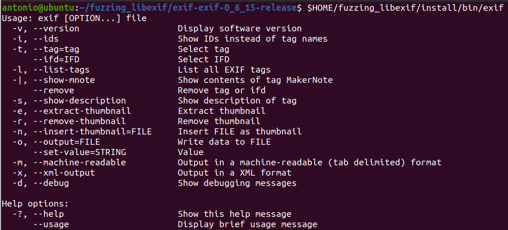
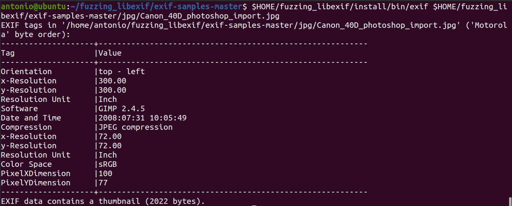
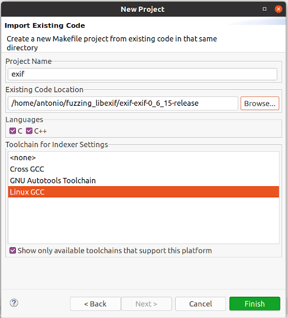
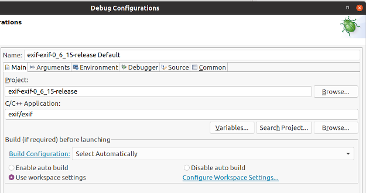
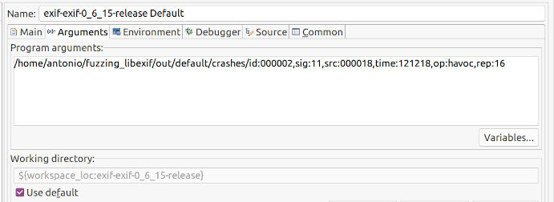

# Exercise 2 - libexif

This time we will fuzz **libexif** EXIF parsing library. The goal is to find a crash/PoC for [**CVE-2009-3895**](https://cve.mitre.org/cgi-bin/cvename.cgi?name=CVE-2009-3895) and another crash for [**CVE-2012-2836**](https://cve.mitre.org/cgi-bin/cvename.cgi?name=CVE-2012-2836) in libexif 0.6.14.

<details>
  <summary>For more information about CVE-2009-3895 and CVE-2012-2836 vulnerabilities, click me!</summary>
  --------------------------------------------------------------------------------------------------------
  
**CVE-2009-3895** is a heap-based buffer overflow that can be triggered with an invalid EXIF image.
  
  A heap-based buffer overflow is a type of buffer overflow that occurs in the heap data area, and it's usually related to explicit dynamic memory management (allocation/deallocation with malloc() and free() functions).
  
  As a result, a remote attacker can exploit this issue to execute arbitrary code within the context of an application using the affected library.
  
  You can find more information about Heap-based buffer oveflow vulnerabilities at the following link: https://cwe.mitre.org/data/definitions/122.html
  
  -------------------------------------------------------------------------
  
  **CVE-2012-2836** is an Out-of-bounds Read vulneratibily that can be triggered via an image with crafted EXIF tags.
  
  An Out-of-bounds Read is a vulnerability that occurs when the program reads data past the end, or before the beginning, of the intended buffer.
  
  As a result, it allows remote attackers to cause a denial of service or possibly obtain potentially sensitive information from process memory.
  
  You can find more information about Out-of-bounds Read vulnerabilities at the following link: https://cwe.mitre.org/data/definitions/125.html
  
</details>
 

## What you will learn
Once you complete this exercise you will know how:
- To fuzz a library using an external application
- To use **afl-clang-lto**, a collision free instrumentation that is faster and provides better results than *afl-clang-fast*
- To use Eclipse IDE as an easy alternative to GDB console for triaging

## Read Before Start
- I suggest you to try to **solve the exercise by yourself** without checking the solution. Try as hard as you can, and only if you get stuck, check out the example solution below.
- AFL uses a non-deterministic testing algorithm, so two fuzzing sessions are never the same. That's why I highly recommend **to set a fixed seed (-s 123)**. This way your fuzzing results will be similar to those shown here and that will allow you to follow the exercises more easily.  
- If you find a new vulnerability, **please submit a security report** to the project. If you need help or have any doubt about the process, the [GitHub Security Lab](mailto:securitylab.github.com) can help you with it :)

## Contact
Are you stuck and looking for help? Do you have suggestions for making this course better or just positive feedback so that we create more fuzzing content?
Do you want to share your fuzzing experience with the community?
Join the GitHub Security Lab Slack and head to the `#fuzzing` channel. [Request an invite to the GitHub Security Lab Slack](mailto:securitylab-social@github.com?subject=Request%20an%20invite%20to%20the%20GitHub%20Security%20Lab%20Slack)

## Environment

All the exercises have been tested on **Ubuntu 20.04.2 LTS**. I highly recommend you to use **the same OS version** to avoid different fuzzing results and to run AFL++ **on bare-metal** hardware, and not virtualized machines, for best performance.

Otherwise, you can find an Ubuntu 20.04.2 LTS VMware image [here](https://drive.google.com/file/d/1_m1x-SHcm7Muov2mlmbbt8nkrMYp0Q3K/view?usp=sharing). You can also use VirtualBox instead of VMware.

The username / password for this VM are `fuzz` / `fuzz`.

## Do it yourself!
In order to complete this exercise, you need to:
1) Find an interface application that makes use of the libexif library
2) Create a seed corpus of exif samples
3) Compile libexif and the chosen application to be fuzzed using afl-clang-lto
4) Fuzz libexif until you have a few unique crashes
5) Triage the crashes to find a PoC for each vulnerability
6) Fix the issues

**Estimated time = 6 hours**

---

<details>
  <summary>SPOILER ALERT! : Solution inside</summary>

### Download and build your target

Let's first get our fuzzing target. Create a new directory for the project we want to fuzz:
```
cd $HOME
mkdir fuzzing_libexif && cd fuzzing_libexif/
```

Download and uncompress libexif-0.6.14:
```
wget https://github.com/libexif/libexif/archive/refs/tags/libexif-0_6_14-release.tar.gz
tar -xzvf libexif-0_6_14-release.tar.gz
```
  
Build and install libexif:

```
cd libexif-libexif-0_6_14-release/
sudo apt-get install autopoint libtool gettext libpopt-dev
autoreconf -fvi
./configure --enable-shared=no --prefix="$HOME/fuzzing_libexif/install/"
make
make install
```

### Choosing an interface application
  
Since libexif is a library, we'll need another application that makes use of this library and which will be fuzzed. For this task we're going to use **exif command-line**. Type the following for download and uncompressing exif command-line 0.6.15:
```
wget https://github.com/libexif/exif/archive/refs/tags/exif-0_6_15-release.tar.gz
tar -xzvf exif-0_6_15-release.tar.gz
```

Now, we can build and install exif command-line utility:
```
cd ..
cd exif-exif-0_6_15-release/
autoreconf -fvi
./configure --enable-shared=no --prefix="$HOME/fuzzing_libexif/install/" PKG_CONFIG_PATH=$HOME/fuzzing_libexif/install/lib/pkgconfig
```
  
To test everything is working properly, just type:
```
$HOME/fuzzing_libexif/install/bin/exif
```
  
and you should see something like that



### Seed corpus creation
  
Now we need to get some exif samples. We're gonna use the sample images from the following repo: https://github.com/ianare/exif-samples. You can download it with:
```
cd $HOME/fuzzing_libexif
wget https://github.com/ianare/exif-samples/archive/refs/heads/master.zip
unzip master.zip
```
  
As an example, we can do:
```
$HOME/fuzzing_libexif/install/bin/exif $HOME/fuzzing_libexif/exif-samples-master/jpg/Canon_40D_photoshop_import.jpg
```
  
And the output should look like


### Afl-clang-lto instrumentation

Now we're going to build libexif using **afl-clang-lto** as the compiler. 

```
rm -r $HOME/fuzzing_libexif/install
cd $HOME/fuzzing_libexif/libexif-libexif-0_6_14-release/
make clean
export LLVM_CONFIG="llvm-config-11"
CC=afl-clang-lto ./configure --enable-shared=no --prefix="$HOME/fuzzing_libexif/install/"
make
make install
```

```
cd $HOME/fuzzing_libexif/exif-exif-0_6_15-release
make clean
export LLVM_CONFIG="llvm-config-11"
CC=afl-clang-lto ./configure --enable-shared=no --prefix="$HOME/fuzzing_libexif/install/" PKG_CONFIG_PATH=$HOME/fuzzing_libexif/install/lib/pkgconfig
make
make install
```

As you can see, I used **afl-clang-lto** instead of *afl-clang-fast*. In general, *afl-clang-lto* is the best option out there because it's a collision-free instrumentation and it's faster than *afl-clang-fast*.

If you are not sure about when to use *afl-clang-lto* or *afl-clang-fast* you can check the following diagram extracted from [AFLplusplus : instrumenting that target](https://github.com/AFLplusplus/AFLplusplus#1-instrumenting-that-target)

```
+--------------------------------+
| clang/clang++ 11+ is available | --> use LTO mode (afl-clang-lto/afl-clang-lto++)
+--------------------------------+     see [instrumentation/README.lto.md](instrumentation/README.lto.md)
    |
    | if not, or if the target fails with LTO afl-clang-lto/++
    |
    v
+---------------------------------+
| clang/clang++ 6.0+ is available | --> use LLVM mode (afl-clang-fast/afl-clang-fast++)
+---------------------------------+     see [instrumentation/README.llvm.md](instrumentation/README.llvm.md)
    |
    | if not, or if the target fails with LLVM afl-clang-fast/++
    |
    v
 +--------------------------------+
 | gcc 5+ is available            | -> use GCC_PLUGIN mode (afl-gcc-fast/afl-g++-fast)
 +--------------------------------+    see [instrumentation/README.gcc_plugin.md](instrumentation/README.gcc_plugin.md) and
                                       [instrumentation/README.instrument_list.md](instrumentation/README.instrument_list.md)
    |
    | if not, or if you do not have a gcc with plugin support
    |
    v
   use GCC mode (afl-gcc/afl-g++) (or afl-clang/afl-clang++ for clang)
```
  
### Fuzzing time

Now, you can run the fuzzer with the following command:
```
afl-fuzz -i $HOME/fuzzing_libexif/exif-samples-master/jpg/ -o $HOME/fuzzing_libexif/out/ -s 123 -- $HOME/fuzzing_libexif/install/bin/exif @@
```
  
After a few minutes, you should have multiple crashes:


### Triage
  
#### Eclipse setup
  
In the exercise 1 we learned how to use GDB console for triaging crashes. In this second exercise, we'll see how to use Eclipse-CDT for debugging purposes.
  
First of all, we can download it from:
https://www.eclipse.org/downloads/download.php?file=/technology/epp/downloads/release/2021-03/R/eclipse-cpp-2021-03-R-linux-gtk-x86_64.tar.gz

If JAVA-SDK is not installed on your system, you can install it on Ubuntu with the following command:
```
sudo apt install default-jdk
```
  
Then we can extract it with:
```
tar -xzvf eclipse-cpp-2021-03-R-linux-gtk-x86_64.tar.gz
```
  
Once we have started Eclipse-CDT, we need to import our source code into the Project Explorer. For that, we need to go to File -> Import -> and then we need to choose C/C++ -> "Existing code as makefile project". Then we need to select "Linux GCC" and browse for the Exif source code folder:
  

  
If all went well, you should be able to see the "exif" folder into the Project explorer tab.
  
  
Now we're going to configure the debug parameters. For that we need to go to `Run -> Debug Configurations`. Then we select our exif project and browse for the exif binary:
  
  
  
Then we need to set the input arguments. For that, go to the `"Arguments"` tab and set the path of one of the AFL crashes.
  

  
Finally, we only need to click on `"Debug"` for starting the debugging sesion and the program will stop at the beginning of the main function.
  
Having got to this point, we only need to click on `Run -> Resume` and the execution will stop when a segmentation fault is detected.
  
  

### Fix the issues
  
The last step of the exercise is to fix both bugs. Rebuild your target after the fixes and check that your PoCs don't crash the program anymore. This last part is left as exercise for the student.
  
  <details>
  <summary>Solution inside</summary>
   --------------------------------------------------------------------------------------------------
    
  Official fixes:
    
  - https://github.com/libexif/libexif/commit/8ce72b7f81e61ef69b7ad5bdfeff1516c90fa361
  - https://github.com/libexif/libexif/commit/00986f6fa979fe810b46e376a462c581f9746e06
    
   </details> 

Alternatively, you can download a newer version of libexif, and check that both bugs have been fixed.
  
</details>
