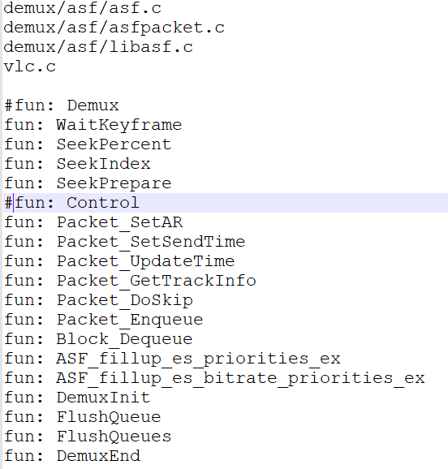
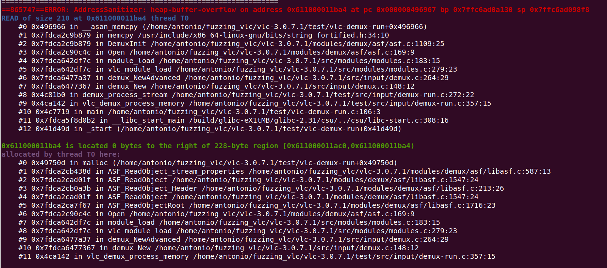

# Exercise 7 - VLC Media Player

For this exercise, we will fuzz **VLC** media player. The goal is to find a crash/PoC for [**CVE-2019-14776**](https://nvd.nist.gov/vuln/detail/CVE-2019-14776) in VLC 3.0.7.1.

<details>
  <summary>For more information about CVE-2019-14776 vulnerability, click me!</summary>
  --------------------------------------------------------------------------------------------------------
  
  **CVE-2019-14776** is an Out-of-bounds Read vulnerability that can be triggered via a crafted WMV/ASF (Windows Media Video) file.
  
 An Out-of-bounds Read is a vulnerability that occurs when the program reads data past the end, or before the beginning, of the intended buffer.

As a result, it allows remote attackers to cause a denial of service or possibly obtain potentially sensitive information from process memory.

You can find more information about Out-of-bounds Read vulnerabilities at the following link: https://cwe.mitre.org/data/definitions/125.html
  
</details>


## What you will learn
Once you complete this exercise you will know:
- How to use Partial Instrumentation to only instrument the relevant parts of the program
- How to write fuzzing harnesses to test large applications more efficiently

## Read Before Start
- I suggest you try to **solve the exercise by yourself** without checking the solution. Try as hard as you can, and only if you get stuck, check out the example solution below.
- AFL uses a non-deterministic testing algorithm, so two fuzzing sessions are never the same. That's why I highly recommend **to set a fixed seed (-s 123)**. This way your fuzzing results will be similar to those shown here and that will allow you to follow the exercises more easily.  
- If you find a new vulnerability, **please submit a security report** to the project. If you need help or have any doubt about the process, the [GitHub Security Lab](mailto:securitylab.github.com) can help you with it :)

## Contact
Are you stuck and looking for help? Do you have suggestions for making this course better or just positive feedback so that we create more fuzzing content?
Do you want to share your fuzzing experience with the community?
Join the GitHub Security Lab Slack and head to the `#fuzzing` channel. [Request an invite to the GitHub Security Lab Slack](mailto:securitylab-social@github.com?subject=Request%20an%20invite%20to%20the%20GitHub%20Security%20Lab%20Slack)

## Environment

All the exercises have been tested on **Ubuntu 20.04.2 LTS**. I highly recommend you to use **the same OS version** to avoid different fuzzing results and to run AFL++ **on bare-metal** hardware, and not virtualized machines, for best performance.

Otherwise, you can find an Ubuntu 20.04.2 LTS VMware image [here](https://drive.google.com/file/d/1_m1x-SHcm7Muov2mlmbbt8nkrMYp0Q3K/view?usp=sharing). You can also use VirtualBox instead of VMware.

The username / password for this VM are `fuzz` / `fuzz`.

## Partial Instrumentation

One of the advantages of using an evolutionary coverage-guided fuzzer is that it’s capable of finding new execution paths all by itself. However, this can often also be a disadvantage. This is particularly true when we face software with a highly modular architecture (as in the case of VLC media player), where each module performs a specific task.

So, let's assume we fed the fuzzer with a valid MKV file. But after several mutations of the input file, the file “magic bytes” have changed and now the input file is viewed as an AVI file by our program. Therefore, this “mutated MKV file” is now processed by AVI Demux. After some time, the file magic bytes change once again and now the file is viewed as an MPEG file. In both cases, the potential of this newly mutated file to increase our code coverage is very poor because this new file won’t have any valid syntax structure.

In short, if we don’t put constraints on code coverage, the fuzzer can easily choose a wrong path which in turn makes the fuzzing process less effective.

To address this problem, AFL++ includes a Partial Instrumentation feature that allows you to specify which functions/files should be compiled with or without instrumentation. This helps the fuzzer focus on the important parts of the program, avoiding undesired noise and disturbance by exercising uninteresting code paths.

To use it, we set the environment AFL_LLVM_ALLOWLIST variable when compiling. This environment variable must point to a file containing all the functions/filenames that should be instrumented.

You can find more information about AFL++ partial instrumentation at: https://github.com/AFLplusplus/AFLplusplus/blob/stable/instrumentation/README.instrument_list.md

## Do it yourself!
In order to complete this exercise, you need to:
1) Write a partial instrumentation file containing the ASF demuxing functions and filenames
2) Create a fuzzing harness for fuzzing ASF file format (persistent mode)
3) Create a seed corpus of ASF samples
4) Optional: Create a fuzzing dictionary for the ASF file format
5) Fuzz VLC until you have a few unique crashes. I recommend you to use as many AFL instances as possible (CPU cores)
6) Triage the crashes to find a PoC for the vulnerability
7) Fix the issues

**Estimated time = 6 hours**

---------------------------------------------------------------------------------------------------------------------------------------------------

<details>
  <summary>SPOILER ALERT! : Solution inside</summary>

### Download the target
  
Let's first get our fuzzing target. Create a new directory for the project you want to fuzz:
```
cd $HOME
mkdir fuzzing_vlc && cd fuzzing_vlc
```
  
Download and uncompress vlc-3.0.7.1.tar.xz:
```
wget https://download.videolan.org/pub/videolan/vlc/3.0.7.1/vlc-3.0.7.1.tar.xz
tar -xvf vlc-3.0.7.1.tar.xz && cd vlc-3.0.7.1/
```
    
### Build VLC:
```
./configure --prefix="$HOME/fuzzing_vlc/vlc-3.0.7.1/install" --disable-a52 --disable-lua --disable-qt
make -j$(nproc)
```

To test everything is working properly, just type:
```
./bin/vlc-static --help
```
  
and you should see something like that


  

### Seed corpus creation
 
You can find a lot of video samples in the [ffmpeg samples repository](https://samples.ffmpeg.org/)
  
I advise you to pick some samples and then, use a video editor to shrink the video file to the smallest size possible. 
  
These are some examples of open-source video editors:
  
- [OpenShot](https://www.openshot.org/)
- [Shotcut](https://shotcut.org/)
  
Or more easily, just copy the [short2.wmv](./InputCorpus/short2.wmv) and [veryshort.wmv](./InputCorpus/veryshort.wmv) files to your AFL input folder.
  
  
### Fuzzing harness
  
If you try to fuzz directly the ``vlc-static`` binary you'll see that AFL only gets a few executions per second. This is because VLC startup is very time-consuming.
  
That's why I recommend you create a custom fuzzing harness for fuzzing VLC.
  
Since the bug exists in the ASF demuxing, I call to the ``vlc_demux_process_memory``
  
I chose to modify the ``./test/vlc-demux-run.c`` file to include my fuzzing harness. In this way, you can compile the harness just by doing:
  
```
cd test
make vlc-demux-run -j$(nproc) LDFLAGS="-fsanitize=address"
cd ..  
```
  
You can find my code changes [here](./fuzzing_harness.patch)
  
  
### Partial instrumentation
  
At first, I tried just including the filenames involved in ASF demuxing. Unfortunately, this approach didn't work.

It seems that matching on filenames is [not always possible](https://github.com/AFLplusplus/AFLplusplus/issues/1018#issuecomment-879045408), so I opted for a mixing approach including function matching and filename matching:
  

  
  
You can download my partial instrumentation file [here](./Partial_instrumentation)

  
### Minor changes
  
To speed-up the ASF fuzzing speed, I recommend you to apply this patch to ``modules/demux/libasf.c``  (no more clues at the moment ;) ) : [speedup.patch](./speedup.patch)
  
### Fuzzing time  
  
Time for building VLC using **afl-clang-fast** as the compiler and with ASAN enabled:
  
```
CC="afl-clang-fast" CXX="afl-clang-fast++" ./configure --prefix="$HOME/fuzzing_vlc/vlc-3.0.7.1/install" --disable-a52 --disable-lua --disable-qt --with-sanitizer=address
AFL_LLVM_ALLOWLIST=$HOME/fuzzing_vlc/vlc-3.0.7.1/Partial_instrumentation make -j$(nproc) LDFLAGS="-fsanitize=address"
```
  
Build the fuzzing harness:
```
cd test
make vlc-demux-run -j$(nproc) LDFLAGS="-fsanitize=address"
cd ..  
```

Now, you can run the fuzzer with the following command:
```
afl-fuzz -t 100 -m none -i './afl_in' -o './afl_out' -x asf_dictionary.dict -D -M master -- ./test/vlc-demux-run @@  
```
  
Some notes:
- The timeout parameter is heavily reliant on the computer. You will need to adjust this value.

  
After a while, you should have multiple crashes:
  

### Triage
  
The ASan trace may look like:
  
  
  
### Fix the issues
  
The last step of the exercise is to fix both bugs. Rebuild your target after the fixes and check that your PoCs don't crash the program anymore. This last part is left as an exercise for the student.
  
  <details>
  <summary>Solution inside</summary>
   --------------------------------------------------------------------------------------------------
    
  Official fixes:
    
  - https://github.com/videolan/vlc/commit/fdbdd677c1e6262f31771b0ba10afb24aabf108c#diff-a22170125046390274dd33c2cb5bb0e99d485e6708b376f40978de9534ac55a9
    
   </details> 

Alternatively, you can download a newer version of libexif, and check that both bugs have been fixed.
  
