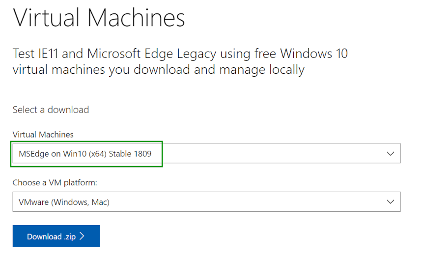
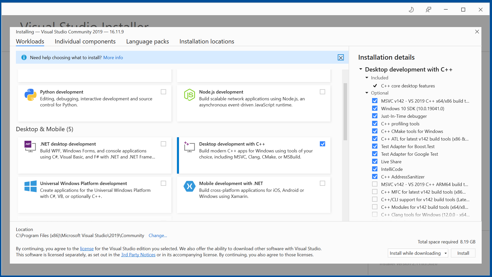
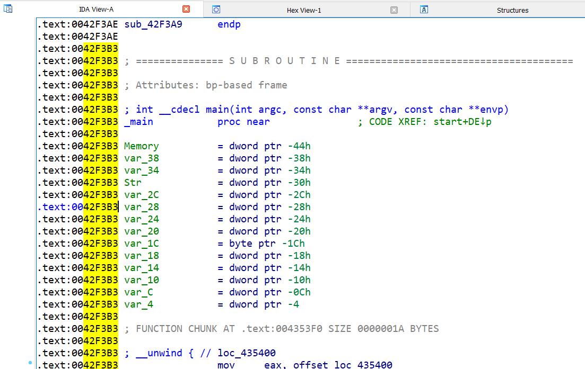
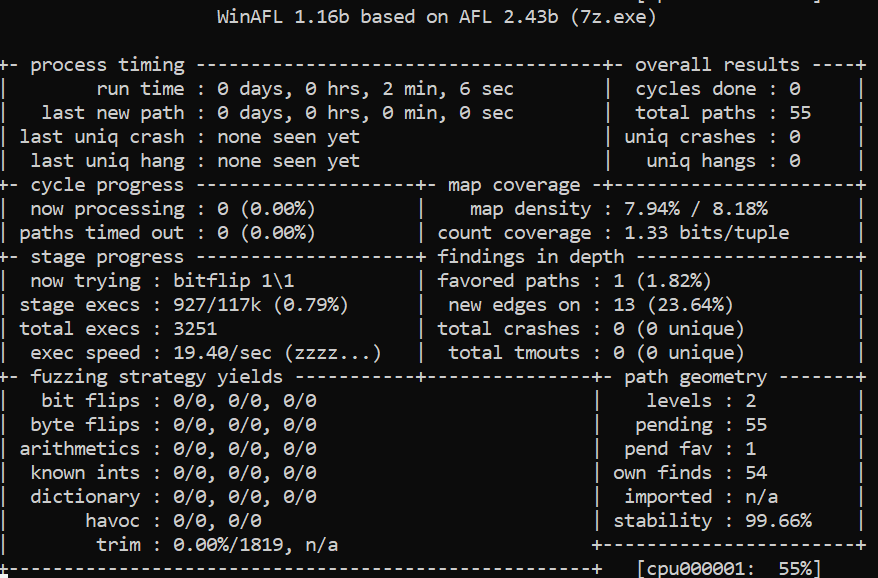

# Exercise 9 - 7-Zip

For this exercise, we will fuzz **7-Zip** file archiver. The goal is to find a crash/PoC for [**CVE-2016-2334**](https://nvd.nist.gov/vuln/detail/CVE-2016-2334) in 7-Zip 15.05. 

--> Kudos to [icewall](https://github.com/icewall) for such an amazing finding.

<details>
  <summary>For more information about CVE-2016-2334 vulnerability, click me!</summary>
  --------------------------------------------------------------------------------------------------------
  
  **CVE-2016-2334** is a heap-based buffer overflow that can be triggered via a crafted HFS+ image.
  
A heap-based buffer overflow is a type of buffer overflow that occurs in the heap data area, and it's usually related to explicit dynamic memory management (allocation/deallocation with malloc() and free() functions).

As a result, a remote attacker can exploit this issue to execute arbitrary code within the context of an application using the affected library.

You can find more information about Heap-based buffer oveflow vulnerabilities at the following link: https://cwe.mitre.org/data/definitions/122.html
  
</details>


## What you will learn
Once you complete this exercise you will know:
- How to use WinAFL to fuzz Windows applications

## Read Before Start
- I suggest you try to **solve the exercise by yourself** without checking the solution. Try as hard as you can, and only if you get stuck, check out the example solution below.
- AFL uses a non-deterministic testing algorithm, so two fuzzing sessions are never the same. That's why I highly recommend **to set a fixed seed (-s 123)**. This way your fuzzing results will be similar to those shown here and that will allow you to follow the exercises more easily.  
- If you find a new vulnerability, **please submit a security report** to the project. If you need help or have any doubt about the process, the [GitHub Security Lab](mailto:securitylab.github.com) can help you with it :)

## Contact
Are you stuck and looking for help? Do you have suggestions for making this course better or just positive feedback so that we create more fuzzing content?
Do you want to share your fuzzing experience with the community?
Join the GitHub Security Lab Slack and head to the `#fuzzing` channel. [Request an invite to the GitHub Security Lab Slack](mailto:securitylab-social@github.com?subject=Request%20an%20invite%20to%20the%20GitHub%20Security%20Lab%20Slack)

## Environment

This exercise has been tested on **Windows 10**. I highly recommend you to use **the same OS version** to avoid different fuzzing results

You can download a free Windows 10 VMware image at the following [link](https://developer.microsoft.com/en-us/microsoft-edge/tools/vms/). You can also use VirtualBox instead of VMware.



The password to the VM is **"Passw0rd!"**

## Do it yourself!
In order to complete this exercise, you need to:
1) Download and build WinAFL (and required dependencies)
2) Create a seed corpus of HFS+ samples
3) Optional: Create a fuzzing dictionary for the HFS+ file format
4) Fuzz 7-Zip until you have a crash
5) Triage the crash to find a PoC for the vulnerability
6) Optional: Find a better *target_offset* to speed up the fuzzing process

**Estimated time = 8 hours**

---------------------------------------------------------------------------------------------------------------------------------------------------

<details>
  <summary>SPOILER ALERT! : Solution inside</summary>
 
### Previous steps 
  
First of all, we need the **Visual Studio compiler** installed in our system. For this exercise, I recommend to use Visual Studio 2019. You can find the Visual Studio 2019 Community Edition installer [here](./resources/vs_community.exe).
  
Then we need to select and install the **"Desktop development with C++"** package:
  

  
We will also need **DynamoRIO 8.0.0**. We can get DynamoRIO Windows binary package from [here](https://github.com/DynamoRIO/dynamorio/releases/download/release_8.0.0-1/DynamoRIO-Windows-8.0.0-1.zip).
  
Then, we need to extract the zip content into the Desktop, as follows:


### Download and build WinAFL
  
Now, we can download WinAFL from the official repository: https://github.com/googleprojectzero/winafl
  
After this, open **"Developer Command Prompt for VS2019"** and change the working directory to the WinAFL directory. Then type:
  
```
mkdir build32
cd build32
cmake -G"Visual Studio 16 2019" -A Win32 .. -DDynamoRIO_DIR=C:\Users\IEUser\Desktop\DynamoRIO-Windows-8.0.0-1\cmake
cmake --build . --config Release
```
  
where `C:\Users\IEUser\Desktop\DynamoRIO-Windows-8.0.0-1\cmake` is the DynamoRIO path on your own system.
  
If all went well, you can now find all the WinAFL binaries in the `winafl-master\build32\bin\Release` folder:
  

  
**Be careful! Don't mismatch this folder with the "bin32" folder**
  
### Download 7-Zip
  
Now it's time to install 7-Zip 15.05. You can find the installer [here](./resources/7z1505.exe). 

### Seed corpus creation
  
I recommend you to create some HFS+ images to feed your seed corpus. This is a trivial task on a Mac OS.
  
In Linux you can use **hfsprogs** utility. In Windows you can use **Paragon HFS+** (commercial software with free trial).
 
To make life easier, you can find an HFS example file [here](./resources/example.img).
  
**Warning! This is just an starting point, you will need to do some extra work on your own**
  
### Fuzzing time  
  
The WinAFL command line is a little bit different than AFL++. Let's see a brief explanation of these new options:
- *-coverage_module* : module for which to record coverage. Multiple module flags are supported
- *-target_module* : module which contains the target function to be fuzzed
- *-target_offset* : offset of the method to fuzz from the start of the module  

As we did in [exercise 8](../../main/Exercise%208), we need to find an appopiate function offset from where the fuzzer will loop: 
  

  
We need the offset of the function from the start of the module. Since the base address is `0x400000`, we will do `0x42F3B3 - 0x400000` and will get `0x02F3B3` as a **target_offset** argument.
  
Now, let's check that the target is running correctly under DynamoRIO:
```
C:\Users\IEUser\Desktop\DynamoRIO-Windows-8.0.0-1\bin32\drrun.exe -c winafl.dll -debug -target_module 7z.exe -target_offset 0x02F3B3 -fuzz_iterations 10 -nargs 2 -- "C:\Program Files (x86)\7-Zip\7z.exe" l C:\Users\IEUser\Desktop\input\test.img
```
  
You should see the output corresponding to your target function being run 10 times after which the target executable will exit.

Finally, we can run the fuzzer with the following command:
```
afl-fuzz.exe -i C:\Users\IEUser\Desktop\afl_in -o C:\Users\IEUser\Desktop\afl_out -t 2000 -D C:\Users\IEUser\Desktop\DynamoRIO-Windows-8.0.0-1\bin32 -- -coverage_module 7z.exe -coverage_module 7z.dll -target_module 7z.exe -target_offset 0x02F3B3 -nargs 2 -- "C:\Program Files (x86)\7-Zip\7z.exe" e -y @@  
```

And you should see WinAFL running:
  


  
### Find a better target_offset
  
The last step of the exercise is find a better target_offset to speed up the fuzzing process. This last part is left as an exercise for the student.
  
**Hint**: 7-Zip is open-source. So you can compile it in debug mode and see function names in your debugger ;)
 
